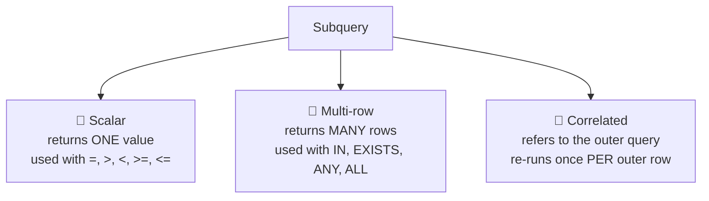

# 📗 Chapter 2: NULL Handling, Subqueries & Comparison Operators
### *(EXISTS · IN · ANY · ALL — SQLite Edition)*

> 🧭 **Reference mapping:** Cheat Sheet Part 1 §11 + Cheat Sheet Part 2 §19–21 + QnA Part 2 (Reference Chapter 4)
> 📌 Continued from Chapter 1. Same `mydata.db` SQLite database.

---

## 2.1 NULL — The Concept Everyone Gets Wrong

> 💡 **NULL means "unknown / missing", not zero, not blank, not an empty string.**

| Rule | Example | Result |
|---|---|---|
| Comparison with NULL | `100 = NULL` | `UNKNOWN` (not TRUE, not FALSE) |
| `<>` with NULL | `100 <> NULL` | `UNKNOWN` |
| Arithmetic with NULL | `100 + NULL` | `NULL` |
| Check for NULL | `col IS NULL` | the only reliable way |
| Check for NOT NULL | `col IS NOT NULL` | the only reliable way |

**Arithmetic with NULL — worked example:**

| profit | sales | `profit + sales` |
|---|---|---|
| 100 | 200 | 300 |
| NULL | 200 | **NULL** |
| 100 | NULL | **NULL** |
| NULL | NULL | **NULL** |

> ⚠️ Any arithmetic touching a NULL produces NULL. Always neutralize NULLs first with `IFNULL`/`COALESCE` (below) if you need a numeric fallback like 0.

---

## 2.2 ⚠️ ISNULL / COALESCE — Another Big MSSQL → SQLite Trap

| | MSSQL | SQLite |
|---|---|---|
| 2-argument NULL replacement | `ISNULL(expr, replacement)` | `IFNULL(expr, replacement)` |
| Does `ISNULL(x, y)` work in SQLite? | — | ❌ **No — syntax error.** `ISNULL` in SQLite is a *different, unrelated* thing: a reserved postfix operator meaning `IS NULL` (e.g. `col ISNULL` ≈ `col IS NULL`). It is **not** a 2-argument function. |
| Multi-argument "first non-null" | not standard, use `COALESCE` | `COALESCE(expr1, expr2, ..., exprN)` ✅ works identically in both engines |

```sql
-- MSSQL (old):  ISNULL(city, 'Unknown')
-- SQLite (new):
SELECT IFNULL(city, 'Unknown') AS city
FROM orders;

-- COALESCE needs NO change — it's standard ANSI SQL, works the same everywhere:
SELECT COALESCE(city, state, 'Unknown') AS resolved_location
FROM orders;
```

| | `IFNULL` | `COALESCE` |
|---|---|---|
| Arguments | exactly 2 | 2 or more |
| Returns | 2nd arg if 1st is NULL | first non-NULL value in the list |
| Standard SQL? | SQLite-specific (alias of `coalesce(a,b)`) | ✅ ANSI standard |

> ✅ **Tip:** Just default to `COALESCE` everywhere — it's portable across every database engine and handles any number of fallback values.

---

## 2.3 COUNT(*) vs COUNT(col) vs COUNT(DISTINCT col)

| Form | Behavior |
|---|---|
| `COUNT(*)` | Counts **all rows**, including ones where every column is NULL |
| `COUNT(col)` | Counts only rows where `col` is **NOT NULL** |
| `COUNT(DISTINCT col)` | Counts unique non-NULL values |

```sql
SELECT
    COUNT(order_id)   AS order_id_count,
    COUNT(postal_code) AS postal_code_count
FROM orders;
-- If postal_code has NULLs anywhere, postal_code_count < order_id_count
```

---

## 2.4 Subqueries — Three Types



**1. Scalar subquery**
```sql
-- Employees earning more than the company-wide average
SELECT name, salary
FROM employee
WHERE salary > (SELECT AVG(salary) FROM employee);
```

**2. Multi-row subquery**
```sql
-- Employees in departments located in Pune
SELECT name, dept_id
FROM employee
WHERE dept_id IN (SELECT dept_id FROM department WHERE city = 'Pune');
```

**3. Correlated subquery** *(re-evaluated once per outer row — slower, but powerful)*
```sql
-- Employees earning more than their OWN department's average
SELECT e.name, e.salary, e.dept_id
FROM employee e
WHERE e.salary > (
    SELECT AVG(e2.salary) FROM employee e2 WHERE e2.dept_id = e.dept_id
);
```
> 💡 We already used this exact pattern in Chapter 1, Q13.

---

## 2.5 EXISTS vs IN (and their anti-join opposites)

| Feature | `EXISTS` | `IN` |
|---|---|---|
| Performance | Better for large datasets | Better for small, static lists |
| Execution | Stops scanning at first match | Scans all values |
| NULL handling | Safe — unaffected by NULLs in subquery | `NOT IN` breaks completely if subquery returns any NULL |
| Typical use | Correlated subquery | Non-correlated subquery / list |
| Syntax | `EXISTS (subquery)` | `IN (subquery)` or `IN (list)` |

```sql
-- 1. EXISTS — customers who have placed orders (correlated)
SELECT c.customer_id, c.customer_name
FROM customer c
WHERE EXISTS (SELECT 1 FROM orders o WHERE o.customer_id = c.customer_id);

-- 2. IN — same result, non-correlated version
SELECT c.customer_id, c.customer_name
FROM customer c
WHERE c.customer_id IN (SELECT o.customer_id FROM orders o);

-- 3. NOT EXISTS — anti-join: customers who have NEVER placed an order
SELECT c.customer_id
FROM customer c
WHERE NOT EXISTS (SELECT 1 FROM orders o WHERE o.customer_id = c.customer_id);

-- 4. NOT IN — same intent, but ⚠️ dangerous if customer_id can be NULL in orders
SELECT c.customer_id
FROM customer c
WHERE c.customer_id NOT IN (SELECT o.customer_id FROM orders o);
```

> ⚠️ **Critical rule:** if the subquery for `NOT IN` can return even a single `NULL`, the entire query silently returns **zero rows** (because `x <> NULL` is `UNKNOWN`, not `TRUE`). Prefer `NOT EXISTS` for anti-joins — it has no such trap. If you must use `NOT IN`, filter NULLs explicitly: `... NOT IN (SELECT o.customer_id FROM orders o WHERE o.customer_id IS NOT NULL)`.

---

## 2.6 🚫 ANY / ALL — Does Not Exist in SQLite!

This is the single biggest functional gap when moving from MSSQL: **SQLite has no `ANY`, `ALL`, or `SOME` keyword for subquery comparisons at all.**
```sql
SELECT * FROM employee WHERE salary > ANY (SELECT salary FROM employee);
-- ❌ syntax error in SQLite — ANY/ALL/SOME simply aren't part of the grammar
```

You must rewrite every `ANY`/`ALL` comparison using `MIN()`/`MAX()` (or `IN`/`NOT IN`):

| MSSQL pattern | Meaning | SQLite rewrite |
|---|---|---|
| `col > ANY (subq)` | greater than **at least one** value | `col > (SELECT MIN(x) FROM subq)` |
| `col > ALL (subq)` | greater than **every** value | `col > (SELECT MAX(x) FROM subq)` |
| `col < ANY (subq)` | less than at least one value | `col < (SELECT MAX(x) FROM subq)` |
| `col < ALL (subq)` | less than every value | `col < (SELECT MIN(x) FROM subq)` |
| `col = ANY (subq)` | equal to at least one | `col IN (subq)` |
| `col <> ALL (subq)` | not equal to any | `col NOT IN (subq)` ⚠️ NULL trap from §2.5 applies |

**Worked conversion:**
```sql
-- MSSQL: ... WHERE salary > ANY (SELECT salary FROM employee WHERE dept = 'Sales');
-- SQLite:
SELECT name, salary
FROM employee
WHERE salary > (SELECT MIN(salary) FROM employee WHERE dept = 'Sales');

-- MSSQL: ... WHERE salary > ALL (SELECT salary FROM employee WHERE dept = 'Sales');
-- SQLite:
SELECT name, salary
FROM employee
WHERE salary > (SELECT MAX(salary) FROM employee WHERE dept = 'Sales');
```
> 💡 Memory aid: **"beats ANY of them"** → just beat the smallest (`MIN`). **"beats ALL of them"** → must beat the biggest (`MAX`).

---

## 2.7 Practice Bank — Chapter 4 QnA (SQLite-adapted)

**Orders where city is NULL**
```sql
SELECT * FROM orders WHERE city IS NULL;
```

**Total profit, first & last order date per category** *(works because dates are stored as sortable ISO `'YYYY-MM-DD'` text)*
```sql
SELECT category,
       SUM(profit)     AS total_profit,
       MIN(order_date) AS first_order,
       MAX(order_date) AS latest_order
FROM orders
GROUP BY category;
```

**Total sales by region + ship_mode, year 2020 only** 🔄 (`YEAR()` → `strftime`)
```sql
SELECT region, ship_mode, SUM(sales) AS total_sales
FROM orders
WHERE strftime('%Y', order_date) = '2020'
GROUP BY region, ship_mode;
```

**Students who scored the same marks in Physics and Chemistry** *(self-join via a shared key — fully portable)*
```sql
SELECT t1.student_id
FROM exams t1
INNER JOIN exams t2 ON t1.student_id = t2.student_id
WHERE t1.subject = 'physics'
  AND t2.subject = 'chemistry'
  AND t1.marks = t2.marks;
```
> 💡 `INNER JOIN` is used because the student must have **both** a Physics and a Chemistry record.

**Total number of distinct products sold per category**
```sql
SELECT category, COUNT(DISTINCT product_id) AS total_products
FROM orders
GROUP BY category;
```

**Top 5 sub-categories by quantity sold, West region** 🔄 (`TOP` → `LIMIT`)
```sql
SELECT sub_category, SUM(quantity) AS quantity_sold
FROM orders
WHERE region = 'West'
GROUP BY sub_category
ORDER BY SUM(quantity) DESC
LIMIT 5;
```

**⚠️ Sub-categories where average profit > half of the GLOBAL maximum profit** *(fully portable — the real lesson is about `GROUP BY` scoping, not syntax)*
```sql
-- ❌ WRONG
SELECT sub_category
FROM orders
GROUP BY sub_category
HAVING AVG(profit) > MAX(profit) / 2;
```
> **Why wrong?** `MAX(profit)` here is computed **per sub_category group** (because of `GROUP BY`), not across the whole table. The requirement asks for the *global* max.

```sql
-- ✅ CORRECT — subquery forces the GLOBAL max, independent of the outer GROUP BY
SELECT sub_category
FROM orders
GROUP BY sub_category
HAVING AVG(profit) > (SELECT MAX(profit) / 2 FROM orders);
```

**More aggregation one-liners** *(all portable except the year filter)*
```sql
SELECT category, SUM(quantity) AS total_quantity FROM orders GROUP BY category;
SELECT ship_mode, AVG(sales)  AS avg_sales    FROM orders GROUP BY ship_mode;
SELECT region,   MAX(profit) AS max_profit   FROM orders GROUP BY region;
SELECT category, MIN(discount) AS min_discount FROM orders GROUP BY category;

-- Number of orders per year 🔄
SELECT strftime('%Y', order_date) AS order_year, COUNT(*) AS no_of_orders
FROM orders
GROUP BY order_year
ORDER BY order_year;
```

---

## 2.8 Join vs Subquery — When to Use Which?

| Technique | Use When |
|---|---|
| **JOIN** | You need columns from multiple tables combined in one result set |
| **Subquery** | You need a single value (or a filtering list) computed from another query |

*(Full JOIN syntax is Chapter 3.)*

---

## 2.9 Best Practices & Quick Reference

> ✅ Always use meaningful aliases for computed/aggregated columns.
> ✅ Always handle NULLs explicitly — don't assume a column is fully populated.
> ✅ `WHERE` filters rows; `HAVING` filters groups — never confuse the two.
> ✅ Use `DISTINCT` inside aggregates carefully — `COUNT(DISTINCT col)` ≠ `COUNT(col)`.
> ✅ Optimize by selecting only the columns you need, especially on large tables.
> ✅ Test queries on a small slice of data before running on the full dataset.

| Clause | Purpose |
|---|---|
| `WHERE` | Filters rows *before* grouping |
| `GROUP BY` | Groups rows by column(s) |
| `HAVING` | Filters groups *after* aggregation |
| `ORDER BY` | Sorts the final result |
| `LIMIT` | Restricts row count — **this replaces MSSQL's `TOP`**, and sits at the very end of the query |

---

➡️ **Next: Chapter 3 — JOINS Mastery & SET Operators**

⭐ *Practice regularly. Understand the logic, not just the syntax. Write efficient queries.* ⭐
