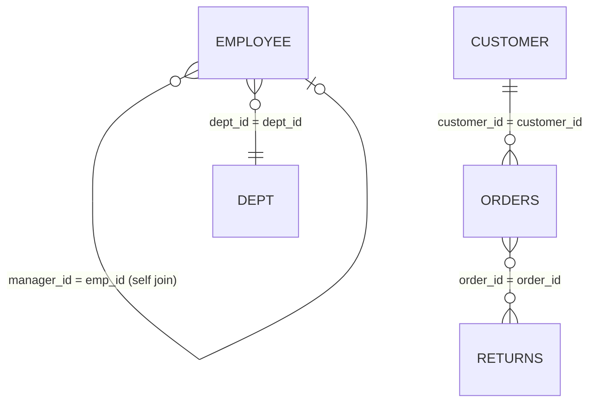
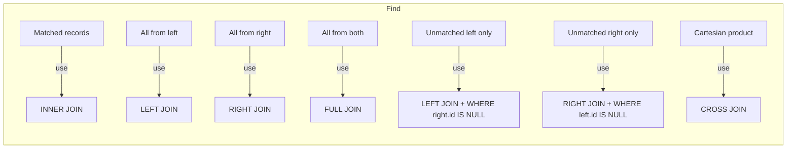

# 📙 Chapter 3: JOINS Mastery & SET Operators
### *(INNER · LEFT · RIGHT · FULL · CROSS · SELF + UNION/INTERSECT/EXCEPT — SQLite Edition)*

> 🧭 **Reference mapping:** Cheat Sheet Part 1 §12–14 + Cheat Sheet Part 2 §18 + QnA Part 3 (Reference Chapter 5)
> 📌 Continued from Chapter 2.
> ✅ **Good news for this chapter:** standard JOIN syntax (`INNER`, `LEFT`, `CROSS`, self-join) is plain ANSI SQL and works **identically** in SQLite — almost nothing here needs rewriting, except one version caveat below (§3.4).

---

## 3.1 Table Relationships (Mental Map)



## 3.2 Joins Overview

| Join Type | Description |
|---|---|
| `INNER JOIN` | Matching rows in both tables only |
| `LEFT JOIN` | All rows from left + matched rows from right |
| `RIGHT JOIN` | All rows from right + matched rows from left |
| `FULL JOIN` | All rows from both tables |
| `CROSS JOIN` | Cartesian product (m × n rows) |
| `SELF JOIN` | A table joined to itself |



---

## 3.3 INNER JOIN

```sql
SELECT a.col1, b.col2
FROM tableA a
INNER JOIN tableB b ON a.id = b.id;     -- matching rows only
```

---

## 3.4 LEFT JOIN + Anti Join

```sql
-- LEFT JOIN: all rows from left + matched right
SELECT a.*, b.col2
FROM tableA a
LEFT JOIN tableB b ON a.id = b.id;

-- Anti Join: unmatched rows from left (rows in A with no match in B)
SELECT a.*
FROM tableA a
LEFT JOIN tableB b ON a.id = b.id
WHERE b.id IS NULL;
```
> 💡 **LEFT JOIN + `IS NULL`** is the standard pattern for "find rows in A that have no counterpart in B" — works identically in SQLite.

---

## 3.5 ⚠️ RIGHT JOIN & FULL JOIN — One Real Version Caveat

| | Old SQLite (< 3.39, pre-2022) | Modern SQLite (≥ 3.39) |
|---|---|---|
| `RIGHT JOIN` | ❌ Not supported | ✅ Supported |
| `FULL JOIN` / `FULL OUTER JOIN` | ❌ Not supported | ✅ Supported |

SQLite added native `RIGHT JOIN` and `FULL OUTER JOIN` support in version **3.39.0 (mid-2022)**. Python's bundled `sqlite3` module on any reasonably current Python (3.11+) ships a version well past this, so they should just work. **If you ever hit a syntax error on RIGHT/FULL JOIN**, your environment has an old SQLite build — emulate them manually:

```sql
-- RIGHT JOIN emulation (swap table order, use LEFT JOIN)
-- "A RIGHT JOIN B" ⇔ "B LEFT JOIN A"
SELECT a.id, b.id
FROM tableB b
LEFT JOIN tableA a ON a.id = b.id;

-- FULL JOIN emulation (UNION of LEFT JOIN both directions)
SELECT a.id, b.id FROM tableA a LEFT JOIN tableB b ON a.id = b.id
UNION
SELECT a.id, b.id FROM tableB b LEFT JOIN tableA a ON a.id = b.id;
```

---

## 3.6 CROSS JOIN

```sql
-- A. Explicit CROSS JOIN — Cartesian product
SELECT e.emp_id, e.emp_name, d.dept_id, d.dep_name
FROM employee e
CROSS JOIN dept d;

-- B. Same result via INNER JOIN with an always-true condition
SELECT e.emp_id, e.emp_name, d.dept_id, d.dep_name
FROM employee e
INNER JOIN dept d ON 1 = 1;     -- 1=1 is always TRUE → behaves exactly like CROSS JOIN

-- C. INNER JOIN with an always-false condition → returns NO rows
SELECT e.emp_id, e.emp_name, d.dept_id, d.dep_name
FROM employee e
INNER JOIN dept d ON 1 = 2;     -- 1=2 is always FALSE → 0 rows
```
All three are fully portable to SQLite, no changes required.

---

## 3.7 SELF JOIN

```sql
-- Employees with their managers (self join)
SELECT e.name AS employee, m.name AS manager
FROM employee e
LEFT JOIN employee m ON e.manager_id = m.emp_id;
```

**Self join TWICE — manager + manager's manager (senior manager):**
```sql
SELECT
    e1.emp_name AS employee_name,
    e2.emp_name AS manager_name,
    e3.emp_name AS senior_manager_name
FROM employee e1
INNER JOIN employee e2 ON e1.manager_id = e2.emp_id
INNER JOIN employee e3 ON e2.manager_id = e3.emp_id;
```
> 💡 Each self-join "hop" goes one level further up the hierarchy.

---

## 3.8 Join Quick Reference

| Goal | Join to Use |
|---|---|
| Matched records only | `INNER JOIN` |
| All from left table | `LEFT JOIN` |
| All from right table | `RIGHT JOIN` |
| Unmatched rows (left) | `LEFT JOIN` + `WHERE right.id IS NULL` |
| Unmatched rows (right) | `RIGHT JOIN` + `WHERE left.id IS NULL` |
| All rows (both tables) | `FULL JOIN` |
| Cartesian product | `CROSS JOIN` |
| Compare rows within same table | `SELF JOIN` |

---

## 3.9 SET Operators — UNION · UNION ALL · INTERSECT · EXCEPT

| Operator | Meaning | Duplicates | Notes |
|---|---|---|---|
| `UNION ALL` | Combine results | Keeps duplicates | Fastest — no dedup step |
| `UNION` | Combine results | Removes duplicates | Slower — needs sort/hash to dedupe |
| `INTERSECT` | Common rows | Rows in **both** sets | |
| `EXCEPT` | A minus B | Rows in A but **not** in B | (MSSQL also calls this `EXCEPT`; SQLite has no `MINUS` — that's Oracle-only) |

> ✅ All four work **exactly the same in SQLite as MSSQL** — no conversion needed here. This is one of the easy chapters!

**Rules:**
- All `SELECT`s in the set operation must return the same number of columns with compatible types.
- Output column names follow the **first** `SELECT`.
- `ORDER BY` can only appear once, at the very end of the whole combined query.

```sql
-- UNION ALL — keeps duplicates
SELECT id, name FROM emp_2023
UNION ALL
SELECT id, name FROM emp_2024;

-- UNION — unique rows across both sets
SELECT id, name FROM emp_2023
UNION
SELECT id, name FROM emp_2024;

-- INTERSECT — rows present in BOTH
SELECT id, name FROM emp_2023
INTERSECT
SELECT id, name FROM emp_2024;

-- EXCEPT — rows in emp_2023 NOT present in emp_2024
SELECT id, name FROM emp_2023
EXCEPT
SELECT id, name FROM emp_2024;
```
> 💡 **Performance tip:** prefer `UNION ALL` over `UNION` whenever duplicates are acceptable — skipping the dedup pass is meaningfully faster on large tables.

---

## 3.10 Practice Bank — Chapter 5 QnA (SQLite-adapted, using your real `orders`/`returns` column names)

**Region-wise count of return orders**
```sql
SELECT o.region,
       COUNT(DISTINCT o.order_id) AS return_order_count
FROM orders o
INNER JOIN returns r ON o.order_id = r.order_id
GROUP BY o.region;
```
> 💡 `COUNT(DISTINCT order_id)` avoids double-counting if an order has multiple return rows.

**Category-wise sales of orders that were NOT returned**
```sql
SELECT o.category, SUM(o.sales) AS total_sales
FROM orders o
LEFT JOIN returns r ON o.order_id = r.order_id
WHERE r.order_id IS NULL
GROUP BY o.category;
```
> 💡 `LEFT JOIN + IS NULL` returns only orders that have **no** matching row in `returns`.

**Top 3 sub-categories by sales of returned orders, East region** 🔄 (`TOP` → `LIMIT`)
```sql
SELECT o.sub_category, SUM(o.sales) AS returned_sales
FROM orders o
INNER JOIN returns r ON o.order_id = r.order_id
WHERE o.region = 'East'
GROUP BY o.sub_category
ORDER BY SUM(o.sales) DESC
LIMIT 3;
```

**Cities where not even a single order was returned**
```sql
SELECT city
FROM orders
GROUP BY city
HAVING SUM(CASE WHEN order_id IN (SELECT order_id FROM returns) THEN 1 ELSE 0 END) = 0;
```

**Departments with no employees** *(generic-table example — see table note in Chapter 1)*
```sql
SELECT d.dep_name
FROM dept d
LEFT JOIN employee e ON d.dep_id = e.dept_id
WHERE e.emp_id IS NULL;
```

**Employees whose dept_id doesn't exist in the dept table**
```sql
SELECT e.emp_name
FROM employee e
LEFT JOIN dept d ON e.dept_id = d.dep_id
WHERE d.dep_id IS NULL;
```

**Departments where average salary, and where NO duplicate salary exists**
```sql
-- Average salary per department
SELECT d.dep_name, AVG(e.salary) AS avg_salary
FROM employee e
LEFT JOIN dept d ON e.dept_id = d.dep_id
GROUP BY d.dep_name;

-- Departments with NO duplicate salary values
SELECT d.dep_name
FROM employee e
INNER JOIN dept d ON e.dept_id = d.dep_id
GROUP BY d.dep_name
HAVING COUNT(e.emp_id) = COUNT(DISTINCT e.salary);
```
> ✅ If `COUNT(emp_id) = COUNT(DISTINCT salary)`, every salary in that department is unique.

**Sub-categories with all 3 kinds of return reasons (others, bad quality, wrong items)**
```sql
SELECT o.sub_category,
       COUNT(DISTINCT r.return_reason) AS return_reason_count
FROM orders o
LEFT JOIN returns r ON o.order_id = r.order_id
WHERE r.return_reason IS NOT NULL
GROUP BY o.sub_category
HAVING COUNT(DISTINCT r.return_reason) = 3;
```

**Employee, manager, and their age difference (in days)**
```sql
SELECT
    t1.emp_name AS employee_name,
    t2.emp_name AS manager_name,
    t2.emp_age - t1.emp_age AS age_difference
FROM employee t1
INNER JOIN employee t2 ON t1.manager_id = t2.emp_id
WHERE t1.emp_age < t2.emp_age;
```
> 💡 Plain subtraction here — no `DATEDIFF` needed since `emp_age` is already numeric (we'll handle real date subtraction with `julianday()` in Chapter 4).

---

## 3.11 Quick Recap (cross-referenced from earlier chapters)

These appear again in the original QnA set but are already covered — just pointers so nothing is "missing":

| Topic | Where it's covered |
|---|---|
| Data aggregation quick reference (COUNT/SUM/MAX/MIN/AVG) | Chapter 1 §1.8 |
| `COUNT(*)` vs `COUNT(column)` | Chapter 2 §2.3 |
| SQL logical execution order | Chapter 1 §1.1 |
| Orders where `city IS NULL` | Chapter 2 §2.7 |
| Total profit / first / last order date per category | Chapter 2 §2.7 |
| Total sales by region + ship_mode for year 2020 | Chapter 2 §2.7 |
| Total distinct products per category | Chapter 2 §2.7 |

---

➡️ **Next: Chapter 4 — CASE WHEN, String Functions, Date/Time Functions & Type Conversion**

⭐ *Practice regularly. Understand the logic, not just the syntax. Write efficient queries.* ⭐
